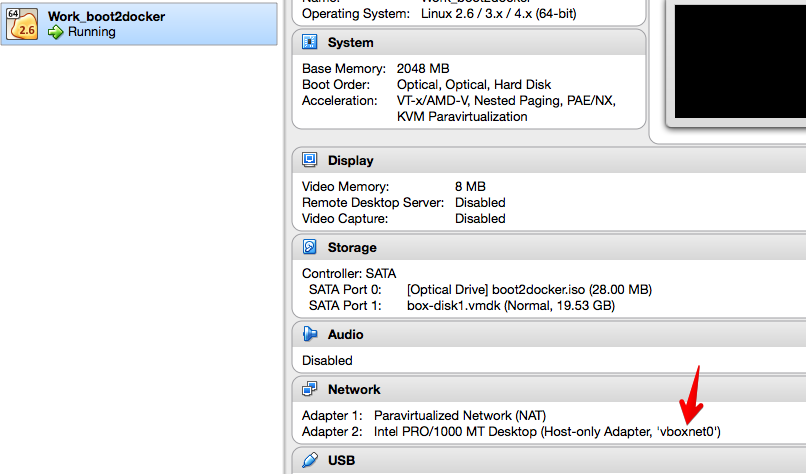
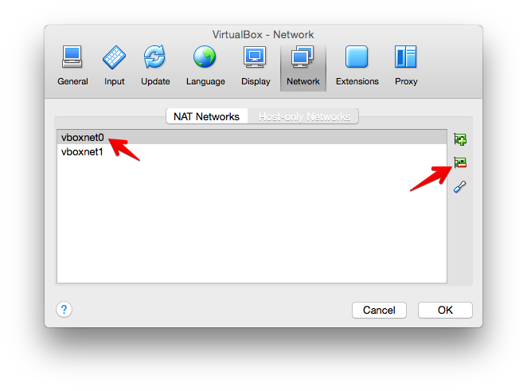

# Troubleshooting

## Boot2docker connection timeout

**Symptoms**

Boot2docker VM fails to boot after multiple "Warning: Connection timeout. Retrying..." messages.  

  

**Cause**

Host machine does not have virtualization support (VT-x) or has it disabled.  
Confirm by attaching to the VM console.  

  

  

**Solution**

Enable VT-x in BIOS.  
Machines without VT-x support won't work with Drude / boot2docker-vagrant / 64bit VirtualBox VMs.

## Various networking issues

**Symptoms**

- "Layer already being pulled by another client"
- [Permission Denied while mounting NFS shared folders](https://github.com/blinkreaction/boot2docker-vagrant/issues/27)
- [Stale NFS handle error](https://github.com/blinkreaction/drude/issues/20)

**Cause**

VirtualBox ships with a preconfigured DHCP server which gets in the way, sometimes in very unobvious cases.  
Sometimes the cause may not be the DHCP server, but a corrupt VM network adapter.

**Solution**

1. Note the Host-only Adapter name used by the VM.

      

2. Open VirtualBox Preferences > Network > Host-only Netowrks and kill that adapter.

    

3. Restart the VM.
